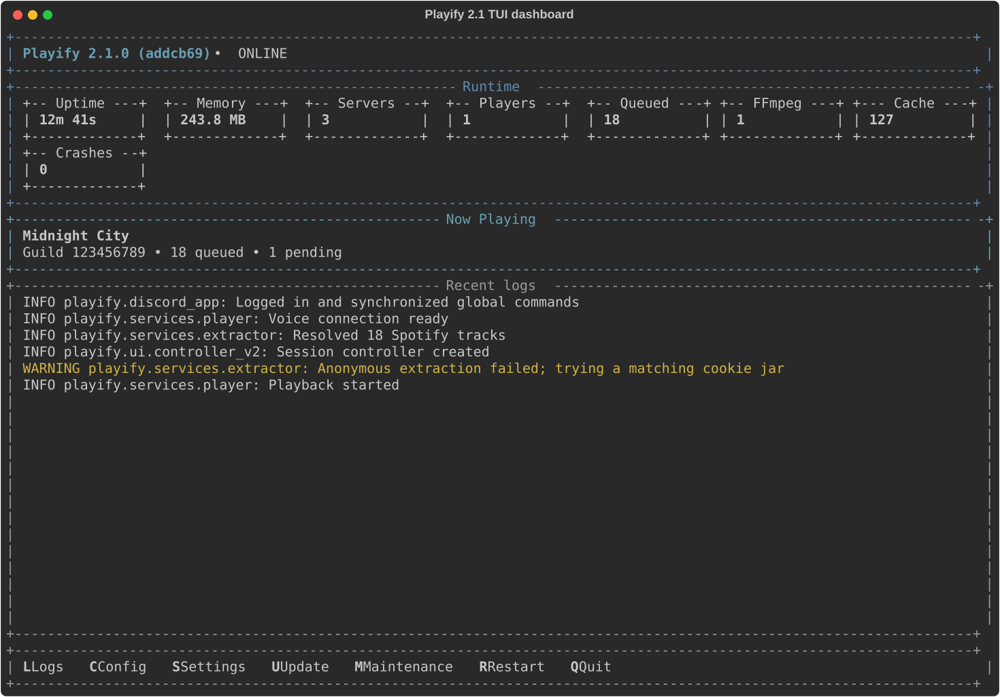

<p align="center">
  
</p>

# Playify 2.1

This fork follows Playify V2's modular Python/TUI architecture while keeping the smaller, self-hosted product direction of the older fork. It is deliberately a personal bot: there is no hosted/public mode, web GUI, Docker image, app bundle, telemetry, or compatibility migration from older database/config layouts.

## Fork comparison

| Area | Upstream V2 | This fork |
|---|---|---|
| Interface | Rich TUI plus upstream setup flows | TUI only, portable `data/` and `bin/` layout |
| Discord | Slash commands plus legacy/message-content behavior | Slash-only `discord.Client`; no privileged message-content intent |
| Sources | Broad catalog and upload support | YouTube/Music, SoundCloud, Twitch, Bandcamp, Spotify, Deezer, Apple Music, Tidal, Amazon Music, and validated direct media URLs |
| Playback | Queue, filters, lyrics/karaoke, uploads, 24/7, autoplay | Queue, dormant resume, autoplay, loop, history, seek, controller; no filters, lyrics, karaoke, uploads, or 24/7 mode |
| State | Upstream V2 SQLite layout | Fresh async `data/playify.db`; Full or Settings-only persistence |
| Operations | TUI updater/installer | Owned virtual environment, managed FFmpeg, structured supervision, and confirmation-based Git updates |
| Documentation | Static documentation site | This README only |

The current version is `2.1.0`. In the TUI and `/status`, Playify also displays the checked-out seven-character Git revision; a non-Git copy displays `unknown`.

<p align="center">
  
</p>

## What it does

- Streams with yt-dlp and FFmpeg without downloading or caching media.
- Resolves complete Spotify, Deezer, Apple Music, Tidal, and Amazon Music collections, retaining successful items if a later page fails.
- Keeps one player and one compact controller in the active Voice/Stage chat per server.
- Supports ordered concurrent imports, stable queue occurrence IDs, unlimited history, loop, autoplay provenance, and resumable dormant sessions.
- Restricts direct media to extension-bearing HTTP(S) links (`mp3`, `wav`, `ogg`, `m4a`, `mp4`, `webm`, `flac`) with DNS/redirect checks and an explicit private-network allowlist.
- Writes rotating local logs with token, credential, and signed-query redaction.
- Runs a responsive dashboard with runtime metrics, player state, a full log viewer, setup, settings, maintenance, restart, and update controls.

## Requirements

- Windows 10/11 x64 or Linux x86-64
- Python 3.12, 3.13, or 3.14
- Git
- A Discord bot token

macOS and ARM builds are not currently promised. You do not need to enable privileged Discord intents.

## Guided installation

Clone this repository so the updater has a real Git checkout:

```text
git clone https://github.com/kianfotovat/simple-playify.git
cd simple-playify
```

On Windows, double-click `start.bat` or run it from Command Prompt. If no supported Python is present, it can offer to install Python 3.14 with `winget`.

On Linux:

```bash
chmod +x start.sh
./start.sh
```

Both launchers run `bootstrap.py`, the canonical application entrypoint. You may also invoke it directly with a supported Python or alias that command as `playify`:

```text
python bootstrap.py
```

On its first run inside a custom virtual environment, bootstrap asks whether Playify should use the project's `.venv` or adopt the detected environment. Neither choice is preselected. Adoption dedicates the entire detected environment to Playify: a dependency refresh deletes and recreates it with Playify's requirements only, so unrelated packages are not restored. Conda environments and environments without a usable external base Python cannot be adopted. Outside a custom virtual environment, Playify manages `.venv` automatically.

Bootstrap initializes the JSON configuration files, checks dependencies, and opens the TUI. The TUI then offers to install an x64 GPL FFmpeg build if neither `bin/ffmpeg` nor a functional `ffmpeg` on `PATH` is available. The configuration wizard verifies credentials when the relevant service is reachable and prints a complete, copyable Discord invite URL; it never opens a browser.

The TUI and bot Python modules are internal subprocess entrypoints and intentionally reject direct invocation.

Copy `.env.example` to `.env` only if you prefer editing credentials manually. `DISCORD_TOKEN` is required; the Spotify ID and secret are optional but must be supplied as a pair.

## Commands

Playback:

- `/play query` — start fresh playback or append while active
- `/playnext query` — place an entire resolved request next, preserving its source order
- `/search query` — choose one result collaboratively
- `/pause`, `/resume`, `/replay`, `/seek [timestamp]`
- `/skip`, `/previous`, `/stop`, `/reconnect`

Queue and modes:

- `/queue`, `/remove`, `/jumpto`, `/clearqueue`, `/shuffle`
- `/loop`, `/autoplay [query]`, `/volume value`

Read-only:

- `/nowplaying`
- `/status`

Server setup (requires Manage Server; administrators qualify):

- `/setup allowlist set channel1 … channel5`
- `/setup allowlist add channel1 … channel5`
- `/setup allowlist remove channel1 … channel5`
- `/setup allowlist clear`
- `/setup allowlist show`
- `/setup channelmove show`
- `/setup channelmove set mode`

An empty allowlist means unrestricted accessible channels. Music-changing commands belong in the text chat attached to a Voice or Stage channel; `/queue`, `/nowplaying`, `/status`, and setup can also be used in allowed text channels. Users need access to the active channel chat but do not have to be connected to voice. Starting or moving playback still requires at least one human in the target voice channel.

## Sources and credentials

Spotify uses the official API first when `SPOTIFY_CLIENT_ID` and `SPOTIFY_CLIENT_SECRET` are present, then falls back to the HTTP-only `spotifyscraper` path. Deezer, Apple Music, Tidal, and Amazon Music metadata use bounded shared HTTP requests; playback is resolved through YouTube first, with the configured SoundCloud fallback where applicable.

For YouTube cookies, place any Netscape-format `.txt` cookie files in `data/cookies/`. Playify tries anonymously first and only scans those files for a targeted retry. Cookie files, logs, settings, installation metadata, temporary files, and the database are ignored by Git.

Private direct-media destinations are blocked by default. Add only specific trusted hosts, IP addresses, or CIDRs through the `private_media_allowlist` setting. Loopback and cloud metadata addresses remain blocked even when listed.

## TUI and persistence

Dashboard hotkeys are `L` logs, `C` config, `S` settings, `U` update, `M` maintenance, `R` restart, and `Q` quit. Config, settings, update inspection, and the maintenance menu do not stop the bot. Choosing a Python dependency/interpreter refresh stops the bot and TUI before bootstrap replaces the environment and restarts Playify. Restart and quit require confirmation; Playify requests a graceful stop for 15 seconds before offering force, wait, or cancel.

Full persistence is the default. Settings-only mode keeps the server allowlist and channel-move policy but purges player state on the next start. Changing from Full to Settings-only intentionally does not migrate old state. Older root-level `config.json` and `playify_state.db` files are never read or migrated.

## Local data disclosure

Playify is self-hosted. Discord supplies command, server, channel, member, and voice-state data needed to run the bot. Playify stores the selected server policy and, in Full mode, queue/playback state in local SQLite. Credentials remain in local `.env`; media is streamed from third-party services; operational logs stay under `data/logs/`. There is no telemetry service or hosted Playify database.

## License and origin

Released under the unchanged [MIT License](LICENSE). Playify was originally created by [alan7383](https://github.com/alan7383/playify).
