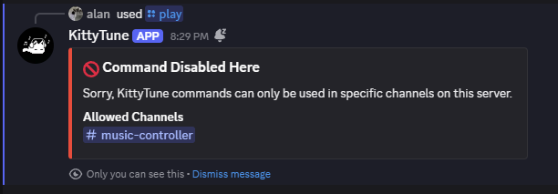

Playify comes with powerful administrative commands to help you manage how it interacts with your server.

## Setting up a music channel (`/setup controller`)

By default, Playify sends ephemeral or standard messages to reply to commands. However, you can create a dedicated music channel with a **persistent controller**.

### How to use it:
1. Create a text channel specifically for the bot (e.g., `#music`).
2. Type `/setup controller` inside that channel.
3. Playify will send a beautiful, interactive dashboard message with playback controls (pause, skip, stop, queue) right in the channel.

> [!TIP]
> The controller is smart! Whenever a new song starts or the queue changes, it will dynamically update itself. It will also "re-anchor" itself to the bottom of the channel if users send other messages.

## Channel restriction (`/setup allowlist`)

If you have a large server, you might want to prevent users from spamming `/play` commands in general chat rooms.

### Restricting commands:
Use the `/setup allowlist` command. You can specify up to 5 text channels where the bot is allowed to be used.
```
/setup allowlist channel1:#music channel2:#bot-commands
```
Once configured, anyone trying to use Playify outside of these channels will receive an error message.

> [!NOTE]
> **Admin Bypass:** Users with the **Manage Server** (`manage_guild`) permission or Server Administrators bypass channel allowlist restrictions and can use bot commands in any channel.



### Resetting the allowlist:
To allow commands everywhere again, run:
```
/setup allowlist reset:default
```

## Kawaii mode (`/kaomoji`)

As a fun easter egg, administrators can run the `/kaomoji` command.
This completely overrides the bot's locale strictly to `en-x-kawaii`. 

When activated, all messages, error codes, and responses will be transformed into a cute format using pink embeds and kaomojis (`(≧◡≦)`, `(╥﹏╥)`). Run it again to disable it.
